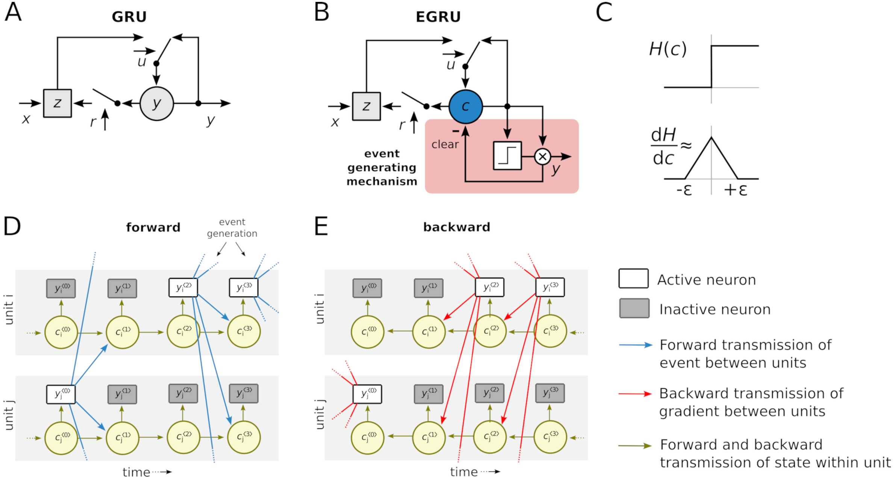

# EvNN: Event-based Neural Networks

EvNN is a CUDA and C++ implementation of event-based RNN layers with built-in [DropConnect](http://proceedings.mlr.press/v28/wan13.html) and [Zoneout](https://arxiv.org/abs/1606.01305) regularization. These layers are exposed through C++ and Pytorch APIs for easy integration into your own projects or machine learning frameworks. The code framework and base layers are adopted from [Haste](https://github.com/lmnt-com/haste/) Library.

## EGRU: Event-based Gated Recurrent Unit

Event based GRU was publised as a conference paper at ICLR 2023: [Efficient recurrent architectures through activity sparsity and sparse back-propagation through time](https://openreview.net/pdf?id=lJdOlWg8td) (**notable-top-25%**)



*Illustration of EGRU. 
**A.** A single unit of the original GRU model adapted from [Cho et al.](#references). 
**B:** EGRU unit with event generating mechanism. 
**C:** Heaviside function and surrogate gradient.
**D:** Forward state dynamics for two EGRU units (*$i$ *and* $j$ *).
**E:** Activity-sparse backward dynamics for two EGRU units (*$i$ *and* $j$ *). 
(Note that we only have to backpropagate through units that were active or whose state was close to the threshold at each time step.)*


Which RNN types are currently supported?
- [GRU](https://en.wikipedia.org/wiki/Gated_recurrent_unit)

What's included in this project?
- a PyTorch API (`evnn_pytorch`) for event based neural networks


## Install
Here's what you'll need to get started:
- a [CUDA Compute Capability](https://developer.nvidia.com/cuda-gpus) 3.7+ GPU (required only if using GPU)
- [CUDA Toolkit](https://developer.nvidia.com/cuda-toolkit) 11.0+ (required only if using GPU)
- [PyTorch](https://pytorch.org) 1.3+ for PyTorch integration (GPU optional)
- [OpenBLAS](https://www.openblas.net/) or any BLAS-like library for CPU computation.

Once you have the prerequisites, you can install with pip or by building the source code.

<!-- ### Using pip
```
pip install evnn_pytorch
``` -->

### Building from source
> **Note**
> 
> Currenty supported only on Linux, use Docker for building on Windows.

Build and install it with `pip`:
```bash
pip install .
```
### Building in Docker

Build docker image:
```bash
docker build -t evnn -f docker/Dockerfile .
```

Example usage:
```bash
docker run --rm --gpus=all evnn python -m unittest discover -p "*_test.py" -s /evnn_src/validation -v
```

> **Note**
> 
> The build script tries to automatically detect GPU compute capability. In case the GPU is not available during compilation, for example when building with docker or when using compute cluster login nodes for compiling, Use enviroment variable `EVNN_CUDA_COMPUTE` to set the required compute capability.

## Performance

Code for the experiments and benchmarks presented in the paper are published in ``benchmarks`` directory.
Note that these benchmarks have additional dependencies as documented in `benchmarks/requirements.txt`

## Documentation

### PyTorch API
```python
import torch
import evnn_pytorch as evnn

# setting use_custom_cuda=False makes the model use pytorch code instead of EvNN extension
egru_layer =  evnn.EGRU(input_size, hidden_size, zoneout=0.0, batch_first=True,
                        use_custom_cuda=True)

egru_layer.cuda()

# `x` is a CUDA tensor with shape [N,T,C]
x = torch.rand([5, 25, 128]).cuda()

y, state = egru_layer(x)
```

The PyTorch API is documented in [`docs/pytorch/evnn_pytorch.md`](docs/pytorch/evnn_pytorch.md).

## Code layout
- [`docs/pytorch/`](docs/pytorch): API reference documentation for `evnn_pytorch`
- [`frameworks/pytorch/`](frameworks/pytorch): PyTorch API and custom op code
- [`lib/`](lib): CUDA kernels and C++ API
- [`validation/`](validation): scripts and tests to validate output and gradients of RNN layers
- [`benchmarks/`](benchmarks): Experiments from ICLR 2023 Paper.

## Testing
use python unittest with this command

- Numpy is required for testing

```
python -m unittest discover -p '*_test.py' -s validation
```
> **Note**
> 
> Tests will fail if you set the the dimensions (batch_size,time_steps,input_size,
hidden_size) too high, this is because floating point errors can accumulate and cause the units to generate events one timestep off. This causes the numerical tests to fail but the Neural Network training will work without any issues.

## Implementation notes
- the EGRU is based on Haste GRU which is in turn based on `1406.1078v1` (same as cuDNN) rather than `1406.1078v3`

## References
1. Nanavati, Sharvil, ‘Haste: A Fast, Simple, and Open RNN Library’, 2020 <https://github.com/lmnt-com/haste/>

1. K. Cho, B. van Merriënboer, C. Gulcehre, D. Bahdanau, F. Bougares, H. Schwenk, and Y. Bengio. Learning phrase representations using RNN encoder–decoder for statistical machine translation. In Proceedings of the 2014 Conference on Empirical Methods in Natural Language Processing (EMNLP), pages 1724–1734, Doha, Qatar, Oct. 2014. Association for Computational Linguistics. doi: 10.3115/v1/D14-1179. [URL](https://aclanthology.org/D14-1179)

<!-- if we have tables from the paper here, then add references -->

## Citing this work
To cite this work, please use the following BibTeX entry:
```
@inproceedings{
evnn2023,
title={Efficient recurrent architectures through activity sparsity and sparse back-propagation through time},
author={Anand Subramoney and Khaleelulla Khan Nazeer and Mark Sch{\"o}ne and Christian Mayr and David Kappel},
booktitle={The Eleventh International Conference on Learning Representations },
year={2023},
url={https://openreview.net/forum?id=lJdOlWg8td},
howpublished={https://github.com/KhaleelKhan/EvNN/}
}
```

## License
[Apache 2.0](LICENSE)
